# Чемпионат по продуктовому программированю УФА 2024

В рамках данного хакатона была разработана серверная часть для мобильного приложения
для занятий спортом на общественных спортивных площалках. По итогам хакатона мы с командой
заняли первое место.
---
[Диплом победителя](other/Диплом%20I%20степени,%20Хакатон,%20Уфа.pdf) \
[Полная презентация продукта](other/UfaPresentation.pdf)
---
### Технологический стек:
* Python
* Flask 
* Psycopg
* Postgresql
---

  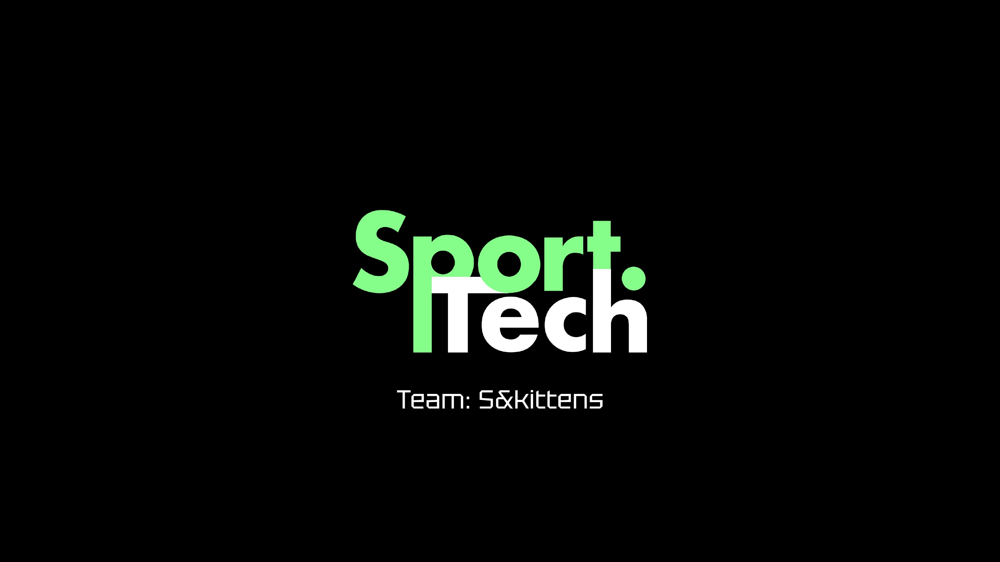

  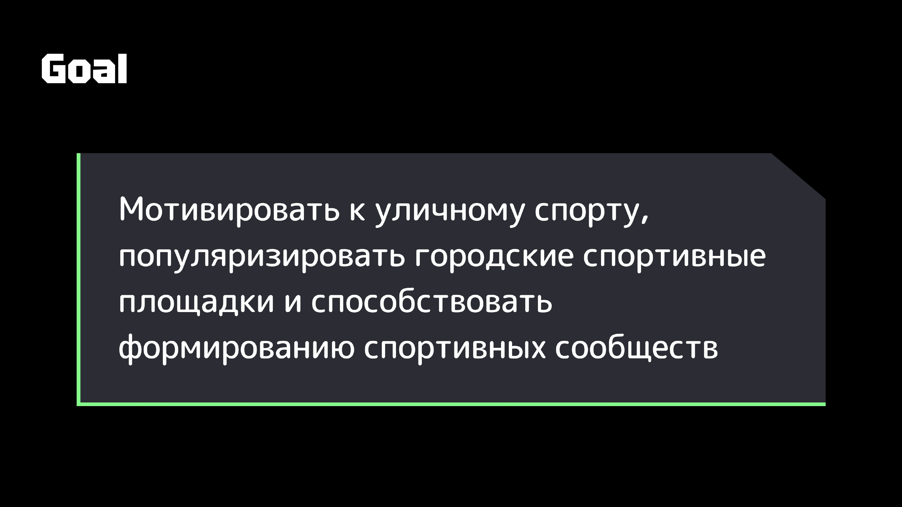

  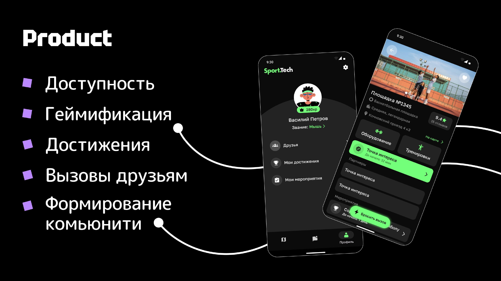

  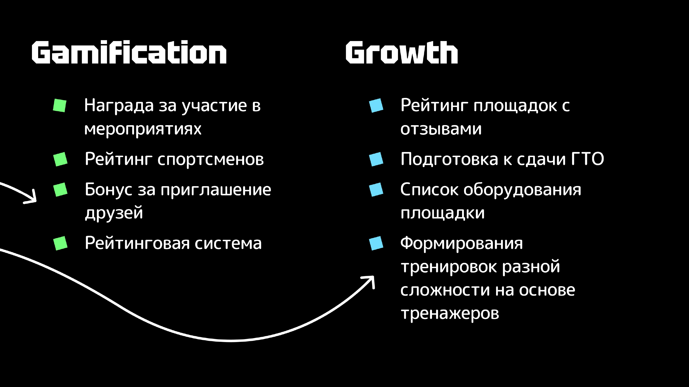

  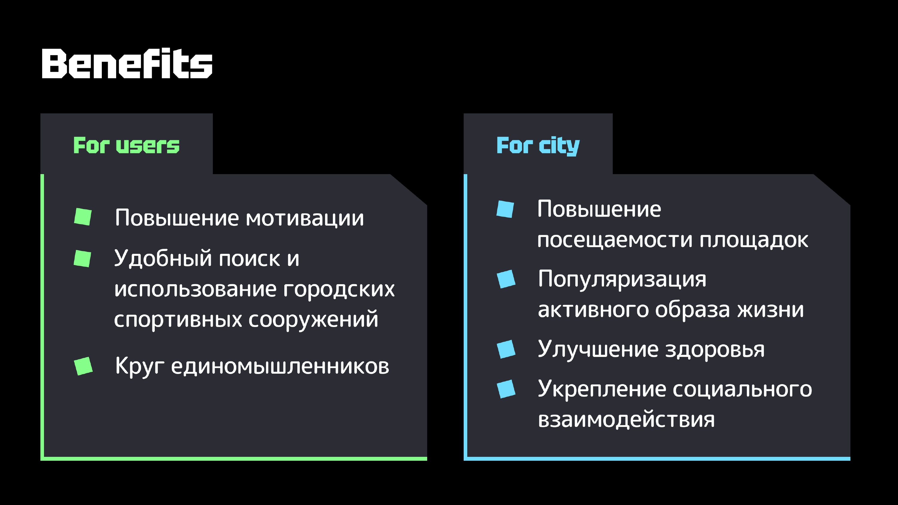

  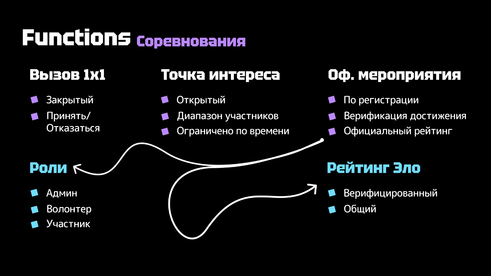

  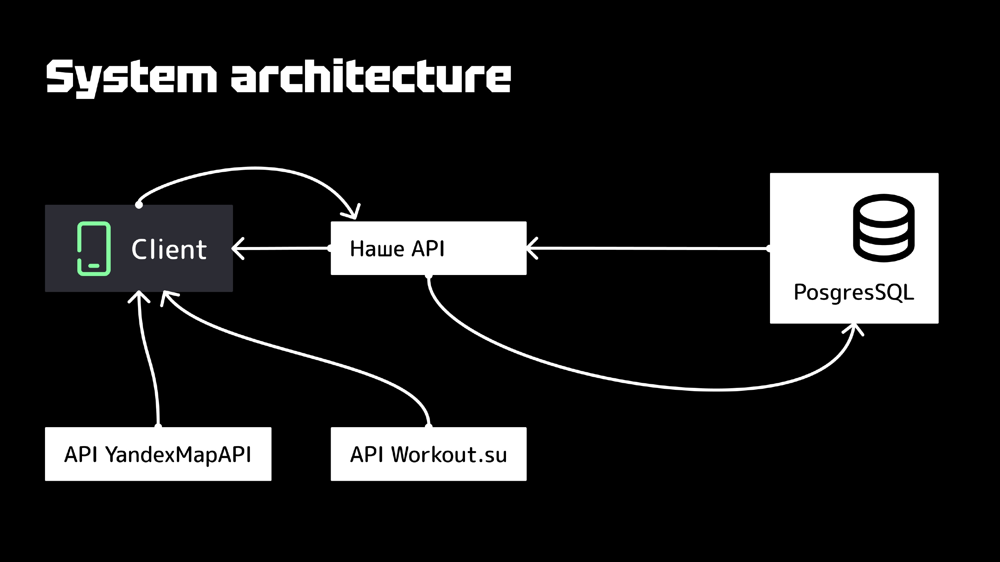

  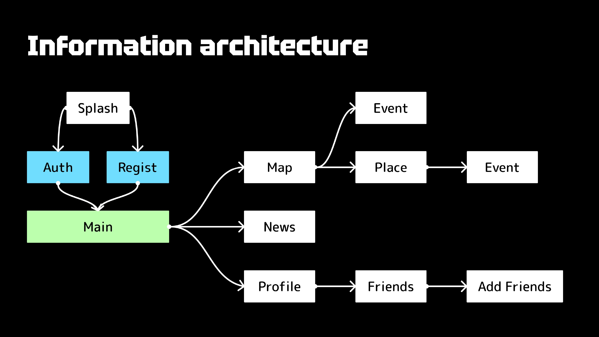

  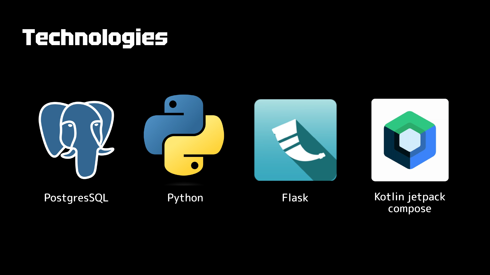

  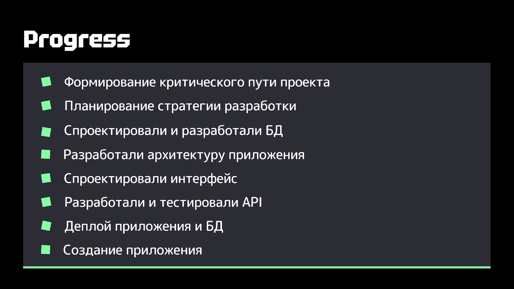

  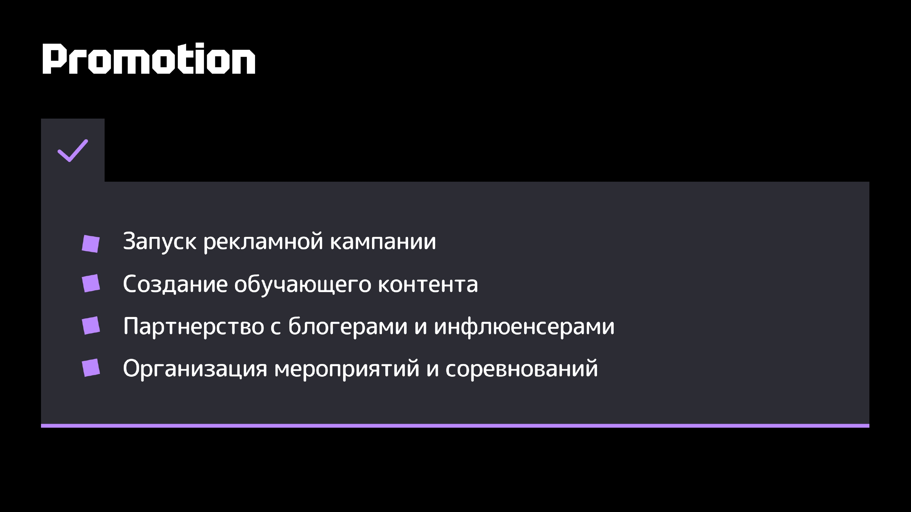

  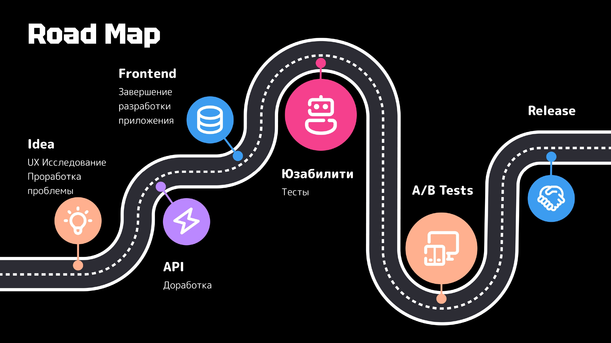

  

---
